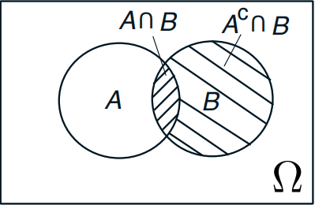
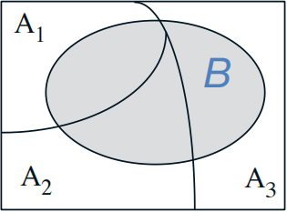

## 使用Rust实现朴素贝叶斯（Naive Bayes）算法

作者： 王江桐、周紫鹏

---

在讨论具体代码之前，首先让我们先了解一下相关概念。

### 条件概率分布

概率可以反映随机事件出现的可能性大小，而随机事件是指在相同条件下，可能出现也可能不出现的事件。条件概率则指，在某一随机事件已经发生的前提下，另一随机事件发生的概率，写作`P(A | B)`。如果用韦恩图表示，可以将事件`A`、`B`发生的概率表示如下：



当`P(B) ≠ 0`时，那么：
$$
P(A\ |\ B) = \frac{P(A\ ∩\ B)}{P(B)}
$$
当事件`B`的发生概率为0时，条件概率`P(A | B)`值为未定义。

当事件`A`与`B`完全独立时，`P(A | B) = P(A)`。


### 贝叶斯定理（Bayes Theorem）

有了上述等式以后，当我们得知事件`B`发生情况下，所有事件`Ai`的发生概率时，我们可以计算事件`B`的发生概率。例如：



事件`B`的概率计算如下：
$$
\begin{aligned}
	P(B) =\ & \ \ \ \ \  P(A_1) \cdot P(B\ |\ A_1) \\
		    &+ P(A_2) \cdot P(B\ |\ A_2) \\
		    &+ P(A_3) \cdot P(B\ |\ A_3) \\
\end{aligned}
$$
贝叶斯定理则在此二者基础上推论，当我们知道事件`Ai`的发生概率，以及事件`B`的条件概率，即当`P(Ai)`且`P(B | Ai)`已知时，我们可以计算事件`Ai`的条件概率，即`P(Ai | B)`：
$$
\begin{aligned}
	P(A_i \ | \ B) &= \frac{P(A_i ∩ B)}{P(B)} \\ 
				   &= \frac{P(A_i) \cdot P(B \ | \ A_i)}{P(B)} \\ 
				   &= \frac{P(A_i) \cdot P(B \ | \ A_i)}{\sum_j^i P(A_j) \cdot P(B \ | \ A_j)} \\ 
\end{aligned}
$$


### 朴素贝叶斯（Naive Bayes）与机器学习

对于贝叶斯定理，换个角度而言，事件`A`也可以看作是调查样本`D`的集合，`Ai`则是其中单独的一份样本，事件`B`则可以认为是某个结论，或某种分类结果，即假说`H`。因此，通过计算假说`H`成立时，样本出现的概率，即计算`P(Di | Hj)`，我们可以通过定理计算`P(Hj | Di)`，即在出现样本`Di`的情况下，假说`H`的`j`分支成立概率是多少。因此，当新样本`Dx`出现时，计算机可以通过贝叶斯定理计算，在出现该样本`Dx`的前提下，假说`H`所有分支`j`成立的概率。计算出这个概率之后，计算机可以选择最高概率的分支，并且预测新样本`Dx`属于该分支。

大致来说，这就是机器学习中的朴素贝叶斯模型。在给定样本集`D`的情况下，则：
$$
\begin{aligned}
	P(H = j_1 \ | \ D_x) &= \frac{P(H = j_1 \ ∩ \ D_x)}{P(D_x)} = \frac{P(D_x \ | \ H = j_1) \cdot P(H = j_1)}{P(D_x)} \\
	P(H = j_2 \ | \ D_x) &= \frac{P(H = j_2 \ ∩ \ D_x)}{P(D_x)} = \frac{P(D_x \ | \ H = j_2) \cdot P(H = j_2)}{P(D_x)} \\
	... \\
	P(H = j_m \ | \ D_x) &= \frac{P(H = j_m \ ∩ \ D_x)}{P(D_x)} = \frac{P(D_x \ | \ H = j_m) \cdot P(H = j_m)}{P(D_x)} \\
\end{aligned}
$$

因此，判定新样本`Dx`属于哪个分支，等同于计算`P(Dx | H = j1) · P(H = j1)`、`P(Dx | H = j2) · P(H = j2)`、...、`P(Dx | H = jm) · P(H = jm)`中的最大值。`P(H = jm)`与`P(Dx | H = jm)`的概率可以用样本中该分支出现的频率以及样本的条件概率模拟。不过，朴素贝叶斯模型依赖于一个大前提：每个样本的出现都是完全独立且随机的。如果它们并不是独立且随机的，概率模拟的准确程度就会受到影响，导致分类器结果更容易出现错误。

朴素贝叶斯分类器（Naive Bayes Classifier）的应用之一是垃圾邮件分类器。一个比较简单的垃圾邮件分类器的工作原理如下：

给定邮件数据集`D`，以及它们对应的二元标签值`T`。已知，当`T = 0`时，该邮件不是垃圾邮件，当`T = 1`时，该邮件是垃圾邮件。将邮件中所有出现的词，认为是该邮件的特征`F`。有了以上信息以后，我们可以模拟计算：

- `P(T)`，即在这些邮件中，`T = 1`以及`T = 0`的概率；
- `P(F | T)`，即在这些邮件中，当邮件是垃圾邮件或非垃圾邮件时，某个特征出现的概率；
- 当认为特征以及数据之间都是相互独立且随机的时候，`P(Fi ∩ Fj | T) = P(Fi | T) · P(Fj | T)`。尽管在实际语言中，两个词语之间并非完全独立且随机出现，但是为了便利，暂且以这种方式计算。因此，可以计算`P(Fj0 ∩ Fj1 ∩ Fj2 ∩ ... ∩ Fjn, Fji ∈ Dj | T) `，即，判定邮件是垃圾邮件的情况下，该邮件`Dj`出现的概率，以及判定非垃圾邮件的情况下，该邮件出现的概率。

再一次，计算出以上信息以后，对于新邮件`Dx`，通过贝叶斯定理，我们可以模拟计算`P(T | Dx)`，即给定该邮件，是或不是垃圾邮件的概率，从而对其进行分类。不过，实际计算中，只需要计算`P(Dx | T) · P(T)`并进行比较，并不需要计算`P(Dx)`。

虽然如此，计算中仍然存在一个问题：如果邮件`Dx`中存在样本邮件中没有出现过的词汇，或是垃圾邮件/非垃圾邮件中未出现的词汇，那么`P(F | T)`的值为0，这会导致整个计算式的乘法结果为0。然而，我们并不能直接判定这个词汇可以直接决定该邮件的标记，因为我们并没有穷尽所有的样本。为了调整这个偏差，可以使用拉普拉斯平滑处理（Laplace Smoothing）来调整概率不为0。拉普拉斯平滑处理为，人为规定数值`α`，在计算概率时，在分子位置加上`α`，在分母位则加上`2α`。在很多场景中，`α = 1`。


### 使用Rust实现朴素贝叶斯分类器

对于给定邮件字符串集合以及它们对应的标记，首先我们需要将其转化成单独的词汇（Token），即获取邮件数据的特征，从而计算相应概率。相对更复杂一点的转换可以涉及词频甚至是词汇的大小写，不过如果只是写一个最基础的朴素贝叶斯分类器，也可以暂时先不考虑这些因素。本文中介绍的实现方法主要来自于《[How to Implement a Naive Bayes Classifier with Rust](https://www.freecodecamp.org/news/implement-naive-bayes-with-rust/)》一文，文中，作者使用了Regex库，通过匹配正则表达式来解析词组。Regex库的具体介绍可见Rust Cook Book[第18章](https://rust-lang-nursery.github.io/rust-cookbook/text/regex.html)，在此暂时不展开了。

解析之后，最原始的做法是，使用`std::collections::HashSet`存储所有的词汇，使用`std::collections::HashMap`存储词汇以及对应的概率。新建两个结构体如下：

```rust
// 单一邮件样本
pub struct Message<'a> {
    pub text: &'a str,
    pub is_spam: bool,
}

// 分类器
pub struct NaiveBayesClassifier {
    pub alpha: f64,
    pub tokens: HashSet<String>,
    pub token_ham_counts: HashMap<String, i32>,
    pub token_spam_counts: HashMap<String, i32>,
    pub spam_messages_count: i32,
    pub ham_messages_count: i32,
}
```

训练朴素贝叶斯分类器则相当于一一解析邮件样本，并且更新对应的数据，以便在预测新样本时进行计算。代码来自于同一篇文章中，摘录如下：

```rust
impl NaiveBayesClassifier {
    pub fn train(&mut self, messages: &[Message]) {
        for message in messages.iter() {
            self.increment_message_classifications_count(message);
            for token in tokenize(&message.text.to_lowercase()) {
                self.tokens.insert(token.to_string());
                self.increment_token_count(token, message.is_spam)
            }
        }
    }

    fn increment_message_classifications_count(&mut self, message: &Message) {
        if message.is_spam {
            self.spam_messages_count += 1;
        } else {
            self.ham_messages_count += 1;
        }
    }

    fn increment_token_count(&mut self, token: &str, is_spam: bool) {
        if !self.token_spam_counts.contains_key(token) {
            self.token_spam_counts.insert(token.to_string(), 0);
        }

        if !self.token_ham_counts.contains_key(token) {
            self.token_ham_counts.insert(token.to_string(), 0);
        }

        if is_spam {
            self.increment_spam_count(token);
        } else {
            self.increment_ham_count(token);
        }
    }

    fn increment_spam_count(&mut self, token: &str) {
        *self.token_spam_counts.get_mut(token).unwrap() += 1;
    }

    fn increment_ham_count(&mut self, token: &str) {
        *self.token_ham_counts.get_mut(token).unwrap() += 1;
    }
}
```

预测时，套用上述公式，可以计算出`P(Dx | T) · P(T)`。在进行`P(Fi ∩ Fj | T) = P(Fi | T) · P(Fj | T)`计算时，由于概率大多都是小数，连续小数的乘积可能会导致精度丢失（Underflow）。因此，将乘积计算替换为对数计算，即：
$$
\begin{aligned}
	P(F_0 \ ∩ \ F_1 \ ∩ \ ... \ ∩ \ F_n \ | \ T) &= P(F_0 \ | \ T) \cdot P(F_1 \ | \ T) \cdot \ ... \ \cdot P(F_n \ | \ T) \\ 
	&→ ln( \ P(F_0 \ | \ T)\cdot P(F_1 \ | \ T) \cdot \ ... \ \cdot P(F_n \ | \ T) \ ) \\
	&= ln(P(F_0 \ | \ T)) \  + \ ln(P(F_1 \ | \ T)) \ + \ ... \ + \ ln(P(F_n \ | \ T))
\end{aligned}
$$


对应的代码摘录如下：

```rust
impl NaiveBayesClassifier {
	pub fn predict(&self, text: &str) -> f64 {
        let lower_case_text = text.to_lowercase();
        let message_tokens = tokenize(&lower_case_text);
        let (prob_if_spam, prob_if_ham) = self.probabilities_of_message(message_tokens);

        return prob_if_spam / (prob_if_spam + prob_if_ham);
    }

    fn probabilities_of_message(&self, message_tokens: HashSet<&str>) -> (f64, f64) {
        let mut log_prob_if_spam = 0.;
        let mut log_prob_if_ham = 0.;

        for token in self.tokens.iter() {
            let (prob_if_spam, prob_if_ham) = self.probabilites_of_token(&token);

            if message_tokens.contains(token.as_str()) {
                log_prob_if_spam += prob_if_spam.ln();
                log_prob_if_ham += prob_if_ham.ln();
            } else {
                log_prob_if_spam += (1. - prob_if_spam).ln();
                log_prob_if_ham += (1. - prob_if_ham).ln();
            }
        }

        let prob_if_spam = log_prob_if_spam.exp();
        let prob_if_ham = log_prob_if_ham.exp();

        return (prob_if_spam, prob_if_ham);
    }

    fn probabilites_of_token(&self, token: &str) -> (f64, f64) {
        let prob_of_token_spam = (self.token_spam_counts[token] as f64 + self.alpha)
            / (self.spam_messages_count as f64 + 2. * self.alpha);

        let prob_of_token_ham = (self.token_ham_counts[token] as f64 + self.alpha)
            / (self.ham_messages_count as f64 + 2. * self.alpha);

        return (prob_of_token_spam, prob_of_token_ham);
    }
}
```

最后，一个可能的测试样本：

```rust
// ...lib.rs

pub fn new_classifier(alpha: f64) -> NaiveBayesClassifier {
    return NaiveBayesClassifier {
        alpha,
        tokens: HashSet::new(),
        token_ham_counts: HashMap::new(),
        token_spam_counts: HashMap::new(),
        spam_messages_count: 0,
        ham_messages_count: 0,
    };
}

#[cfg(test)]
mod tests {
    use super::*;

    #[test]
    fn naive_bayes() {
        let train_messages = [
            Message {
                text: "Free Bitcoin viagra XXX christmas deals 😻😻😻",
                is_spam: true,
            },
            Message {
                text: "My dear Granddaughter, please explain Bitcoin over Christmas dinner",
                is_spam: false,
            },
            Message {
                text: "Here in my garage...",
                is_spam: true,
            },
        ];

        let alpha = 1.;
        let num_spam_messages = 2.;
        let num_ham_messages = 1.;

        let mut model = new_classifier(alpha);
        model.train(&train_messages);

        let mut expected_tokens: HashSet<String> = HashSet::new();
        for message in train_messages.iter() {
            for token in tokenize(&message.text.to_lowercase()) {
                expected_tokens.insert(token.to_string());
            }
        }

        let input_text = "Bitcoin crypto academy Christmas deals";

        let probs_if_spam = [
            1. - (1. + alpha) / (num_spam_messages + 2. * alpha), // "Free"  (not present)
            (1. + alpha) / (num_spam_messages + 2. * alpha),      // "Bitcoin"  (present)
            1. - (1. + alpha) / (num_spam_messages + 2. * alpha), // "viagra"  (not present)
            1. - (1. + alpha) / (num_spam_messages + 2. * alpha), // "XXX"  (not present)
            (1. + alpha) / (num_spam_messages + 2. * alpha),      // "christmas"  (present)
            (1. + alpha) / (num_spam_messages + 2. * alpha),      // "deals"  (present)
            1. - (1. + alpha) / (num_spam_messages + 2. * alpha), // "my"  (not present)
            1. - (0. + alpha) / (num_spam_messages + 2. * alpha), // "dear"  (not present)
            1. - (0. + alpha) / (num_spam_messages + 2. * alpha), // "granddaughter"  (not present)
            1. - (0. + alpha) / (num_spam_messages + 2. * alpha), // "please"  (not present)
            1. - (0. + alpha) / (num_spam_messages + 2. * alpha), // "explain"  (not present)
            1. - (0. + alpha) / (num_spam_messages + 2. * alpha), // "over"  (not present)
            1. - (0. + alpha) / (num_spam_messages + 2. * alpha), // "dinner"  (not present)
            1. - (1. + alpha) / (num_spam_messages + 2. * alpha), // "here"  (not present)
            1. - (1. + alpha) / (num_spam_messages + 2. * alpha), // "in"  (not present)
            1. - (1. + alpha) / (num_spam_messages + 2. * alpha), // "garage"  (not present)
        ];

        let probs_if_ham = [
            1. - (0. + alpha) / (num_ham_messages + 2. * alpha), // "Free"  (not present)
            (1. + alpha) / (num_ham_messages + 2. * alpha),      // "Bitcoin"  (present)
            1. - (0. + alpha) / (num_ham_messages + 2. * alpha), // "viagra"  (not present)
            1. - (0. + alpha) / (num_ham_messages + 2. * alpha), // "XXX"  (not present)
            (1. + alpha) / (num_ham_messages + 2. * alpha),      // "christmas"  (present)
            (0. + alpha) / (num_ham_messages + 2. * alpha),      // "deals"  (present)
            1. - (1. + alpha) / (num_ham_messages + 2. * alpha), // "my"  (not present)
            1. - (1. + alpha) / (num_ham_messages + 2. * alpha), // "dear"  (not present)
            1. - (1. + alpha) / (num_ham_messages + 2. * alpha), // "granddaughter"  (not present)
            1. - (1. + alpha) / (num_ham_messages + 2. * alpha), // "please"  (not present)
            1. - (1. + alpha) / (num_ham_messages + 2. * alpha), // "explain"  (not present)
            1. - (1. + alpha) / (num_ham_messages + 2. * alpha), // "over"  (not present)
            1. - (1. + alpha) / (num_ham_messages + 2. * alpha), // "dinner"  (not present)
            1. - (0. + alpha) / (num_ham_messages + 2. * alpha), // "here"  (not present)
            1. - (0. + alpha) / (num_ham_messages + 2. * alpha), // "in"  (not present)
            1. - (0. + alpha) / (num_ham_messages + 2. * alpha), // "garage"  (not present)
        ];

        let p_if_spam_log: f64 = probs_if_spam.iter().map(|p| p.ln()).sum();
        let p_if_spam = p_if_spam_log.exp();

        let p_if_ham_log: f64 = probs_if_ham.iter().map(|p| p.ln()).sum();
        let p_if_ham = p_if_ham_log.exp();

        // P(message | spam) / (P(messge | spam) + P(message | ham)) rounds to 0.97
        assert!((model.predict(input_text) - p_if_spam / (p_if_spam + p_if_ham)).abs() < 0.000001);
    }
}
```
